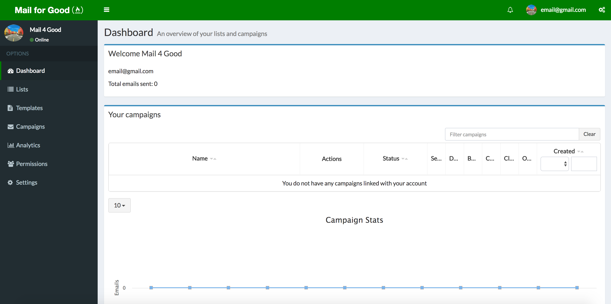

# Mail for Good

*Please be aware that Mail for Good is currently in beta.*

Looking to contribute? Read our [developer setup guide](https://github.com/freeCodeCamp/Mail-for-Good/wiki/Setup-for-development).

---

An app for sending millions of emails as cheaply as possible. Mail for Good uses AWS Simple Email Service to send bulk emails at $0.10 per 1000 emails.

Mail for Good is fast and memory efficient, currently sending over 100 emails per second on a 1gb Digital Ocean VPS.

We've used Mail for Good to deliver newsletters to hundreds of thousands of campers per week.

[**Click here to view our youtube video and get started.**](https://www.youtube.com/watch?v=_7U03GVD4a8)

## What does Mail for Good do?

With Mail for Good you can:

- Send email campaigns of unlimited size.
- Import emails saved in CSV format.
- Create templates to reuse for convenience when sending email campaigns.
- Track bounce rate and other standard metrics. You can also insert tracking pixels and unsubcribe links a click of a button.
- Add custom fields to imported email lists such as names or cities.
- Grant other users (limited or otherwise) permissions to use your account on your behalf.
- Add embedded HTML newsletter sign up forms to your site. These are snippets of code that will let your users sign up with you at the click of a button.

### Performance

We're currently sending weekly email blasts of over 700,000 emails in 3-4 hours on a $10 per month Digital Ocean VPS with 1gb memory and 1 core processor.

Mail for Good is fast and scales to the rate limit enforced by AWS.

### Why are we doing this?

We want to help nonprofits manage their email campaigns as inexpensively as possible, and have full control over their data.

### How to install

Mail for good uses lots of different services (redis, Postgres and so on) that would make manual installation arduous. To streamline this process, we use Docker.

###### Your machine

Mail for good is designed to be memory efficient, nonetheless the amount of memory needed will depend on how many emails you are capable of sending per second (this limited is placed by Amazon). We **strongly suggest you enable swap space** if your VPS does not enable this automatically (such as DigitalOcean).

We suggest a machine with at least 2gb memory.

###### On a Amazon Web Services instance
After following the steps described in the preinstallation below and shown in [**this video**](https://www.youtube.com/watch?v=_7U03GVD4a8), follow the steps in our [**deploy.md**](./docs/deploy.md).

###### Preinstallation

First, keep in mind that this application uses [Amazon SES](https://aws.amazon.com/ses/). Your account will initially be [limited by Amazon](http://docs.aws.amazon.com/ses/latest/DeveloperGuide/manage-sending-limits.html). To increase these limits, check out Amazon's documentation [here](http://docs.aws.amazon.com/ses/latest/DeveloperGuide/increase-sending-limits.html).

Before installing this application, you'll need some API keys from Google to handle authentication. This can be done in a few steps:

1. Login to [Google API Manager](https://console.developers.google.com/apis/).
2. In the left menu, select **Dashboard**. Now select **Enable API**, search for `Google+` and select it. At the top of the screen, ensure it's enabled by clicking on **Enable**.
3. In the left menu, select **Credentials**. Then click **Create Credentials** > **OAuth client ID**.
4. Select **Web Application**. Name is as you wish, but under **Authorised Javascript Origins** put `http://localhost:8080`, and under **Authorised redirect URIs** put `http://localhost:8080/auth/google/callback`.
5. Click **Create**. You will now have a Client ID and Client Secret. In your .env file, put the Client ID as your GOOGLE_CONSUMER_KEY, and the Client Secret as your GOOGLE_CONSUMER_SECRET.

###### Installing with Docker

The first step is to download Docker itself. The process for this differs depending your OS. You can find a guide here https://docs.docker.com/engine/installation/.

Now, clone the repository and change into it.

Edit the `.env.example` file in your root directory.

After this, you'll need to create your own .env file. Check out the .env.example file in this repo. From the terminal, you can run `cp .env.example .env` then edit the .env file with any editor of your choice. There are instruction in this file that you can follow.

Now run `docker-compose up`. This will run all the containers needed to launch this app, and will take some time to finish.

When the process is finished, the app will be exposed on port 8080 and accessible by visiting `http://[hostname]:8080`. You may use a reverse proxy such as Nginx to serve the app on port 80.

###### Installation summary

1. Install and run the Docker daemon.
2. Clone the repository and change into it `git clone https://github.com/freeCodeCamp/Mail-for-Good && cd Mail-for-Good`.
3. Run `cp .env.example .env` then open `.env` and edit it, passing in your own values.
4. Run `docker-compose up`. Wait for it to finish.
5. Visit `http://[hostname]:8080` or `localhost:8080` if running locally.

### Troubleshooting

We're keen to tackle any issues people encounter. If you experience any problems, please create an issue and we'll get back to you.

If at any point you changed a file after running `docker-compose`, run `docker-compose up --force-recreate` to ensure they're included.

### How to contribute

Found a bug? Please let us know by [creating an issue](https://github.com/freeCodeCamp/Mail-for-Good/issues/new).

We warmly welcome contributions from anyone. Check out our [how to contribute](https://github.com/FreeCodeCamp/nonprofit-email-service/blob/master/CONTRIBUTING.md) section to find out how you can do so.

### License

Copyright (c) 2017, freeCodeCamp.

This computer software is licensed under the [BSD-3-Clause](https://github.com/freeCodeCamp/Mail-for-Good/blob/master/LICENSE.md).
