Deploying Mail for Good on AWS
===================


Creating the blank instance
--------------

Right after you log in AWS you will land on this page
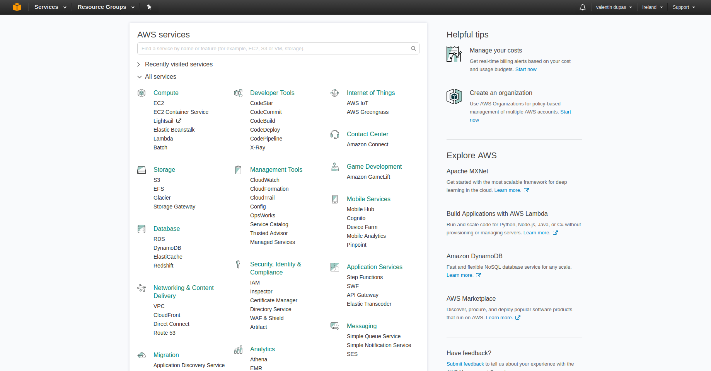


Scroll down until you see the "build a solution" box like below and select "Launch a virtual machine"
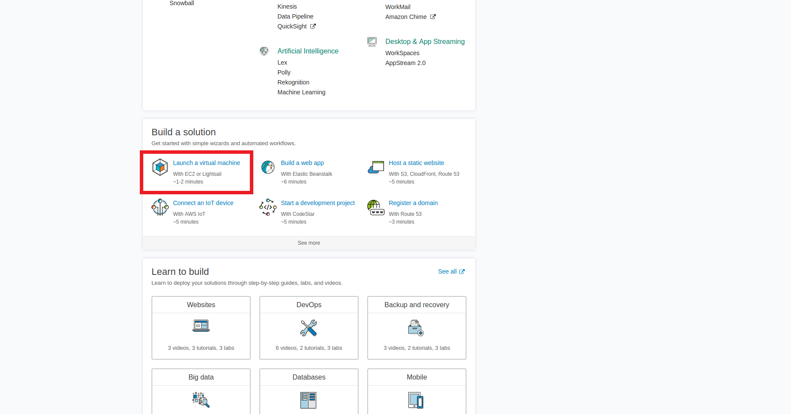

Click on the "Get started" button in the "EC2 Instance" box.
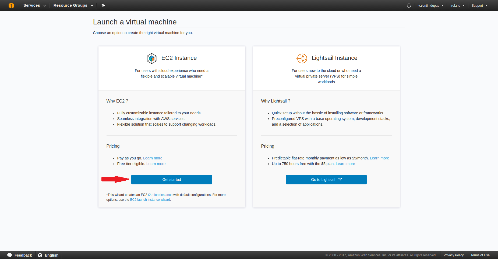

Give a name to your instance. In the example, we will go with "Mail-for-Good"
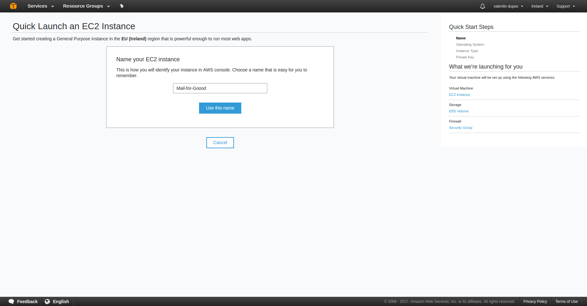

Select Ubuntu as your operating system
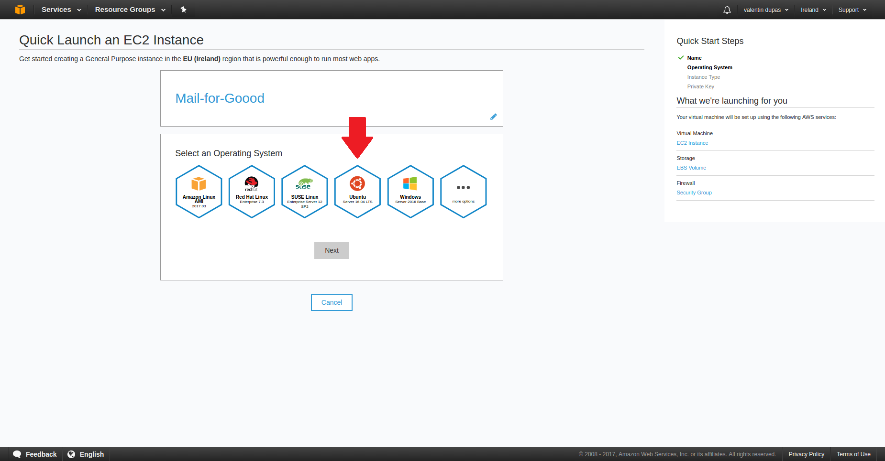

Here the preselected type of instance is fine.(t2.micro instances are eligible to the free tier)
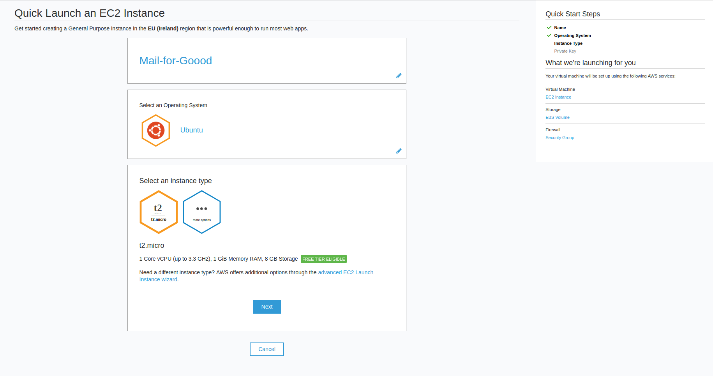

AWS will create a pair of keys to your instance. You will have to supply this file every time you will want to log into your instance. Right now AWS is just asking for a name. For the example, we will go with "MfG-private-key". For the example, we will also store this file in our home. /home/{your username}/ also written ~/
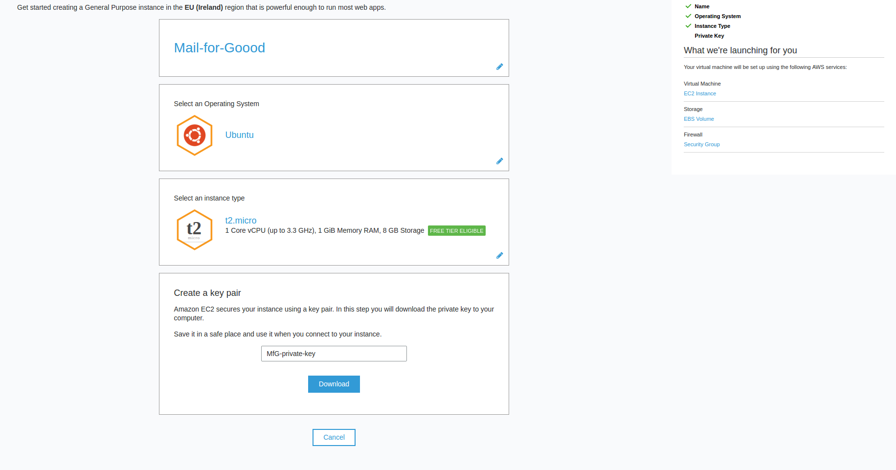

Now AWS is creating your instance.
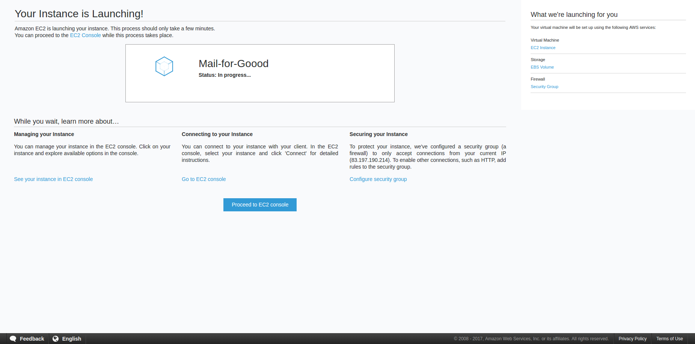

You should see this once it's done.


Allow your instance to receive requests from your clients
---------
In the navbar at the top of your screen select "EC2" under the "Compute" category.


In the menu on the left of your screen, click on "Instances"


Then scroll the box containing the instances to its far right until you see "security Groups"
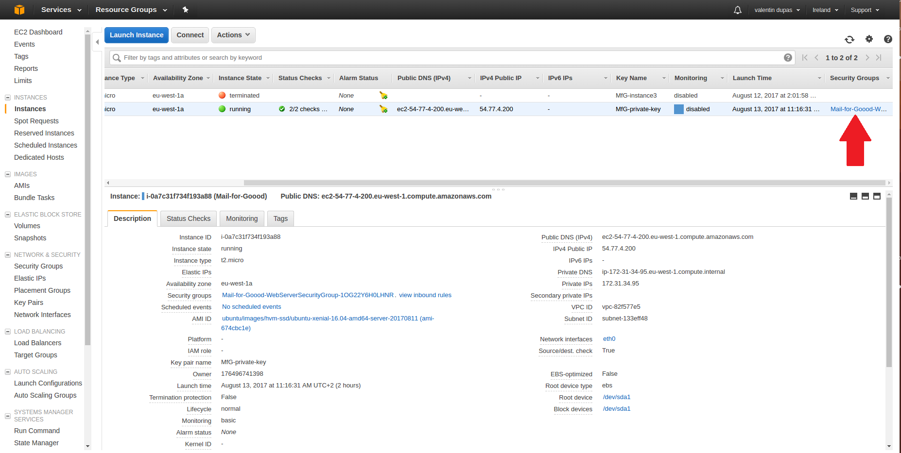


click on the security group of your instance and open tho "Inbound" tab
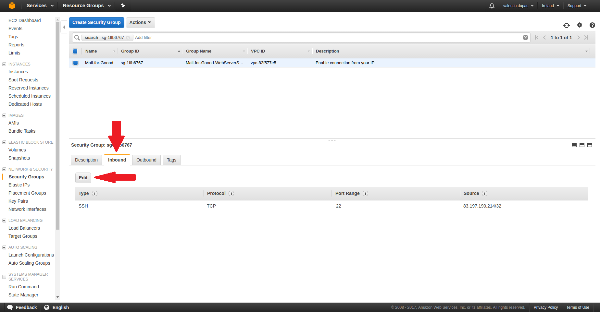
then "Edit"

Add the following rule
type:custom tcp rule
protocol: tcp
port range:8080
source: custom 0.0.0.0/0, ::/0


Deploying Mail for Good on your instance
---------
### Log into the instance
In the navbar at the top of your screen select "EC2" under the "Compute" category.

In the menu on the left of your screen, click on "Instances"

Select your instance then take note of the "Public DNS (IPv4)" of your application. In this case, ours is "ec2-54-77-4-200.eu-west-1.compute.amazonaws.com"
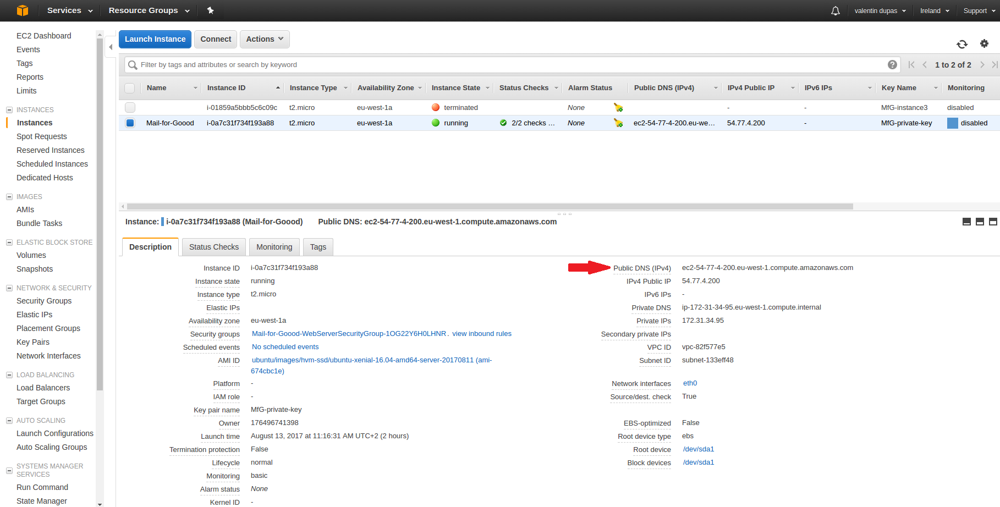

In the following commands you will need to adapt what's put in between <> and remove the <>

Before using SSH you will need to make your key Publicly viewable by running
```
chmod 400 <path to your key>
```
Which would be the following command for our example
```
chmod 400 ~/MfG-private-key.pem
```

Use your terminal to log into your instance.
```
ssh -i "<path to the key file you downloaded earlier>" ubuntu@<your Public DNS (IPv4)
```
So, in our examle we would have to use thin command
```
ssh -i "~/MfG-private-key.pem" ubuntu@ec2-54-77-4-200.eu-west-1.compute.amazonaws.com
```

If everything went well so far you should have the following text displayed in your terminal
```
Welcome to Ubuntu 16.04.3 LTS (GNU/Linux 4.4.0-1030-aws x86_64)

 * Documentation:  https://help.ubuntu.com
 * Management:     https://landscape.canonical.com
 * Support:        https://ubuntu.com/advantage

  Get cloud support with Ubuntu Advantage Cloud Guest:
    http://www.ubuntu.com/business/services/cloud

0 packages can be updated.
0 updates are security updates.


The programs included with the Ubuntu system are free software;
the exact distribution terms for each program are described in the
individual files in /usr/share/doc/*/copyright.

Ubuntu comes with ABSOLUTELY NO WARRANTY, to the extent permitted by
applicable law.

To run a command as administrator (user "root"), use "sudo <command>".
See "man sudo_root" for details.

```

You are now logged in your instance. All the next command are to be done while logged in your AWS instance.

### Installing docker and docker-compose on your instance
The installation process of docker is taken from here https://docs.docker.com/engine/installation/linux/docker-ce/ubuntu/ check this for more details

update your apt package index :
```
$ sudo apt-get update
```
Install packages to allow apt to use a repository over HTTPS:
```
$ sudo apt-get install \
 apt-transport-https \
 ca-certificates \
 curl \
 software-properties-common
```
Add Docker’s official GPG key:
```
$ curl -fsSL https://download.docker.com/linux/ubuntu/gpg | sudo apt-key add -
```
Install the docker version currently marked as "stable"
$ sudo add-apt-repository \
 "deb [arch=amd64] https://download.docker.com/linux/ubuntu \
 $(lsb_release -cs) \
 stable"

To install docker-compose you need to run the next command
```
sudo apt-get install docker-compose
```

### Using docker-compose to launch Mail-for-Good
Import Mail-for-Good
```
git clone https://github.com/freeCodeCamp/mail-for-good && cd Mail-for-Good
```

Create a .env file
```
cp .env.example
```

Then edit your .env according to the comments present in it.
(to quit, use Ctrl+X. Nano will ask  you to confirm then ask for the name of the file, don't change it)
```
nano .env
```

Launch Mail-for-Good
```
sudo docker-compose up
```

You may now put your "Public DNS (IPv4)" into the url bar of your browser followed by :8080 to land on your Mail-for-Good
In our example we would query "ec2-54-77-4-200.eu-west-1.compute.amazonaws.com:8080"
